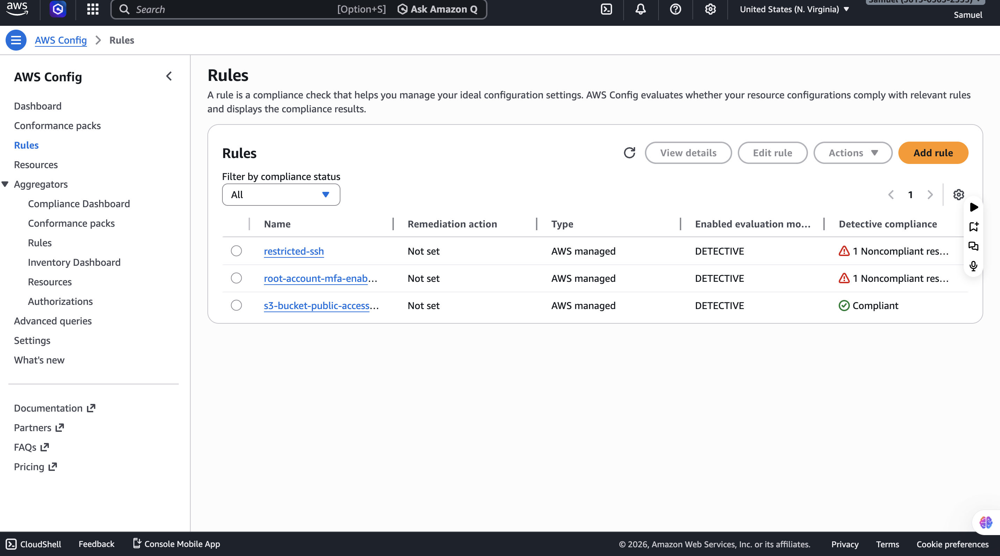
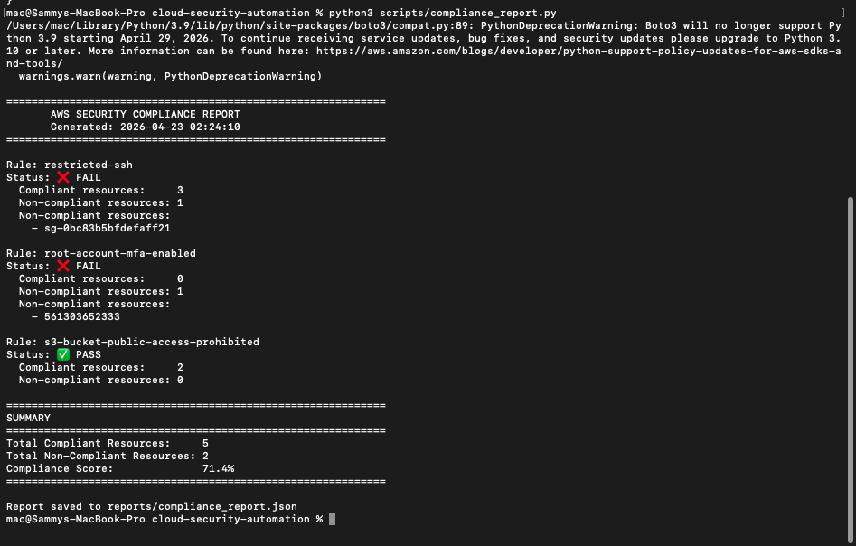
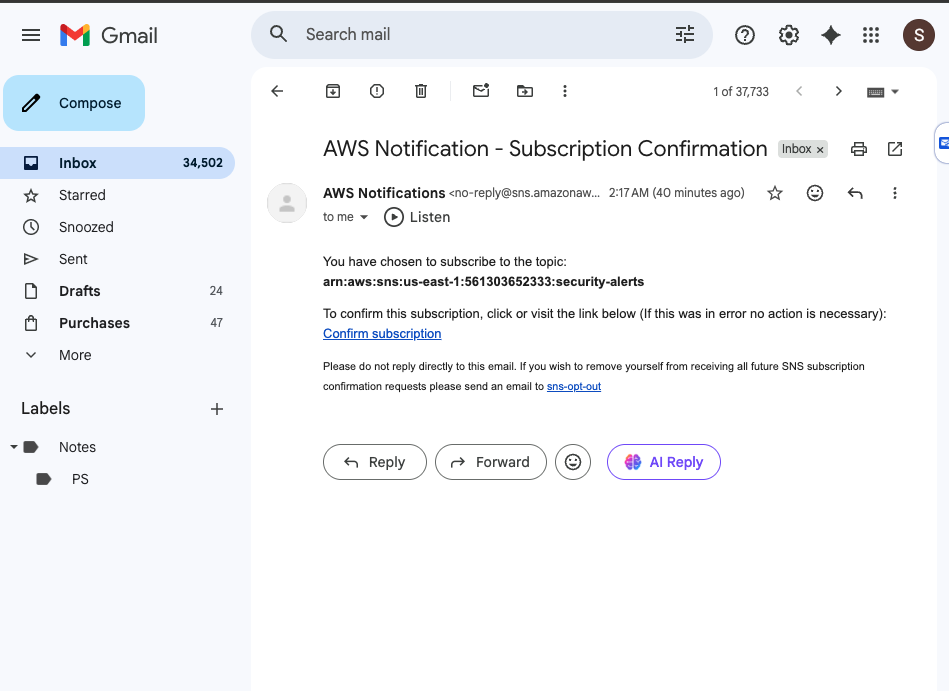

# cloud-security-automation
AWS cloud security automation — Config rules for compliance monitoring, Lambda functions for auto-remediation of S3 and security group misconfigurations, and automated compliance reporting with Python and Boto3
# Cloud Security & Compliance Automation

An automated AWS cloud security system that continuously monitors resources for misconfigurations, generates compliance reports, and auto-remediates security violations using AWS Config, Lambda, SNS, and Python (Boto3).

---

## Architecture

```
AWS Config (monitors all resources)
        │
        │ detects misconfiguration
        ▼
AWS SNS Topic
        │
        ├──→ Email Alert
        │
        └──→ AWS Lambda
                  │
                  │ auto-remediates
                  ▼
           Fixed Resource
     (S3 blocked / SG cleaned)
```

---

## Technologies Used

- **AWS Config** — continuously monitors AWS resources for compliance
- **AWS Lambda** — serverless functions for auto-remediation
- **AWS SNS** — email alerting for security violations
- **AWS IAM** — secure role-based permissions
- **Python 3** — scripting and automation
- **Boto3** — AWS SDK for Python

---

## Project Structure

```
cloud-security-automation/
├── lambda/
│   ├── remediate_s3.py         # Auto-blocks public S3 buckets
│   └── remediate_sg.py         # Auto-removes dangerous SG rules
├── scripts/
│   ├── setup.py                # Sets up entire AWS security stack
│   └── compliance_report.py    # Generates compliance report
└── reports/
    └── compliance_report.json  # Latest compliance scan results
```

---

## Security Rules Configured

| Rule | What It Checks | Severity |
|------|---------------|----------|
| `s3-bucket-public-access-prohibited` | S3 buckets must not be publicly readable | High |
| `restricted-ssh` | Security groups must not allow SSH from 0.0.0.0/0 | High |
| `root-account-mfa-enabled` | Root account must have MFA enabled | Critical |

---

## Auto-Remediation

### S3 Bucket Public Access
When AWS Config detects a public S3 bucket, the Lambda function automatically blocks all public access:
```python
s3_client.put_public_access_block(
    Bucket=bucket_name,
    PublicAccessBlockConfiguration={
        'BlockPublicAcls':       True,
        'IgnorePublicAcls':      True,
        'BlockPublicPolicy':     True,
        'RestrictPublicBuckets': True
    }
)
```

### Security Group Dangerous Rules
Automatically removes ingress rules that expose sensitive ports (22, 3389, 3306, 5432, 27017) to the open internet (0.0.0.0/0).

---

## Sample Compliance Report

```
============================================================
       AWS SECURITY COMPLIANCE REPORT
       Generated: 2026-04-23 02:24:10
============================================================

Rule: restricted-ssh
Status: ❌ FAIL
  Compliant resources:     3
  Non-compliant resources: 1

Rule: root-account-mfa-enabled
Status: ❌ FAIL
  Compliant resources:     0
  Non-compliant resources: 1

Rule: s3-bucket-public-access-prohibited
Status: ✅ PASS
  Compliant resources:     2
  Non-compliant resources: 0

============================================================
SUMMARY
============================================================
Total Compliant Resources:     5
Total Non-Compliant Resources: 2
Compliance Score:              71.4%
============================================================
```

---

## How to Deploy

### Prerequisites
- AWS account with IAM user credentials
- AWS CLI configured (`aws configure`)
- Python 3.10+ installed
- Boto3 installed (`pip3 install boto3`)

### Steps

```bash
# 1. Clone the repository
git clone https://github.com/Samuelaliu/cloud-security-automation.git
cd cloud-security-automation

# 2. Install dependencies
pip3 install boto3

# 3. Run the setup script
python3 scripts/setup.py
# Enter your email when prompted
# Confirm the subscription email you receive

# 4. Verify Config rules are active
aws configservice describe-config-rules --region us-east-1

# 5. Generate compliance report
python3 scripts/compliance_report.py
```

---

## Screenshots

### AWS Config Rules Active


### Compliance Report Output


### SNS Alert Email


---

## Key Concepts Demonstrated

**Compliance as Code** — Security rules are defined in code and automatically enforced across all AWS resources, removing the need for manual audits.

**Auto-Remediation** — When a violation is detected, Lambda functions automatically fix the issue without human intervention — reducing response time from hours to seconds.

**Least Privilege** — The IAM role created for AWS Config has only the minimum permissions needed to perform its job.

**Defense in Depth** — Multiple overlapping security controls (S3 blocking, SG rules, MFA) ensure no single point of failure.

---

## Lessons Learned

- AWS Config takes a few minutes to evaluate resources after rules are created — patience is needed before running compliance reports
- IAM role propagation can take 10-15 seconds — always add a wait after creating roles before using them
- Real AWS accounts have real misconfigurations — the compliance report found actual security issues including an open SSH security group and missing root MFA
- SNS email subscriptions must be confirmed before alerts are delivered

---

## Cleanup

```bash
# Delete Config rules
aws configservice delete-config-rule --config-rule-name restricted-ssh --region us-east-1
aws configservice delete-config-rule --config-rule-name root-account-mfa-enabled --region us-east-1
aws configservice delete-config-rule --config-rule-name s3-bucket-public-access-prohibited --region us-east-1

# Stop Config recorder
aws configservice stop-configuration-recorder --configuration-recorder-name default --region us-east-1

# Delete SNS topic
aws sns delete-topic --topic-arn arn:aws:sns:us-east-1:561303652333:security-alerts
```

---

## Author

**Samuel** — IT Support Specialist & Cloud Infrastructure Engineer  
[GitHub](https://github.com/Samuelaliu) • [LinkedIn](https://www.linkedin.com/in/aliusamuel/)
